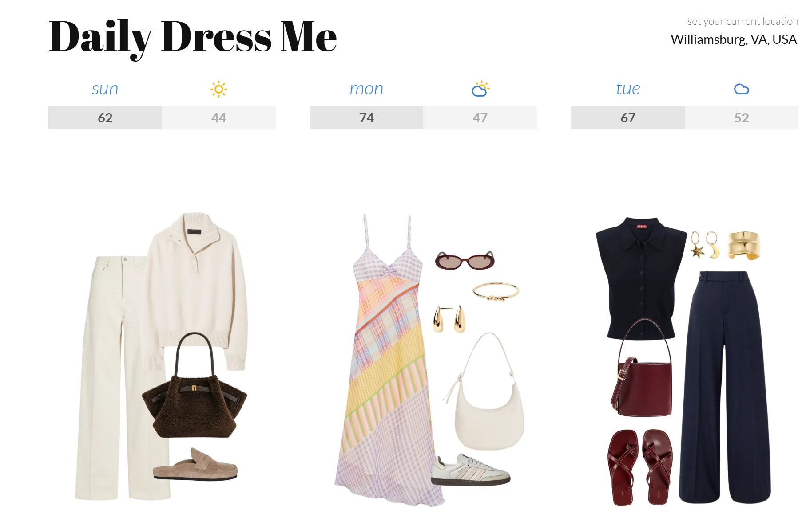
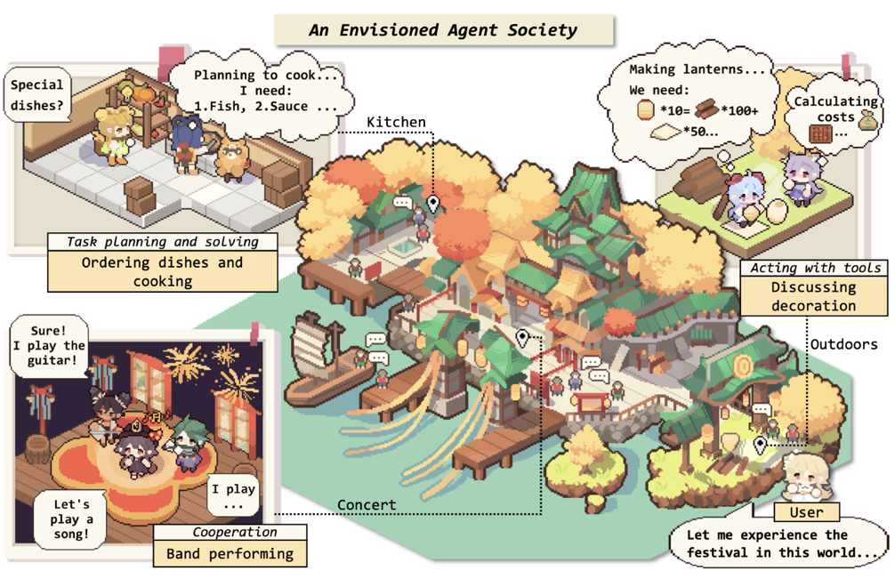

# Slay-gent: Weather-Based Outfit Assistant
## Authors:  
▪️Leah Pak ([GitHub](https://github.com/Leahdotcom) |  [LinkedIn](https://www.linkedin.com/in/leah-pak)) 

▪️Quentin Phillips ([GitHub](https://github.com/QuentinPhil) | [LinkedIn](https://www.linkedin.com/in/quentin-phillips-01b95215/)) 

▪️Molly McDade ([GitHub](https://github.com/mtmcdade) | [LinkedIn](https://www.linkedin.com/in/molly-mcdade111/))

## 📋 Project Scope: 
This website suggests what to wear based on the weather in your city. You can choose between men's or women's clothing styles with a simple toggle button. You type in your location, and it uses the OpenWeatherMap API to get current temperature, conditions, humidity, and wind speed. Then it sends this weather data to the Groq AI API to generate personalized outfit recommendations that match the conditions. The AI creates detailed descriptions of four clothing items (shirt, pants, shoes, and an accessory) and also generates an image prompt that's sent to Pollinations.ai to create a visual representation of the outfit. Finally, a shopping link for each clothing item is generated by taking the name of the recommended piece and creating a simple Amazon search URL, making it easy to find and purchase similar items.     

we believe this tool could be useful for businesses in a variety of fashion-related sectors. Retail companies, like Amazon, could implement it as a personalized shopping assistant on their websites, helping customers discover weather-appropriate items from their inventory while increasing conversion rates. Fashion brands could use it for targeted marketing campaigns that recommend seasonal collections based on local weather patterns. In short, this tool could be directly integrated into vendor websites to help customers make weather-informed clothing purchases.

## ✨ Project Inspiration: 

This project was inspired by the website [Daily Dress Me](https://dailydressme.com/), which is a platform that depicts outfit inspiration based on a user's IP address. The main inspiration for our project was that this website has 3 key areas it could improve upon: 1) options for men's styling 2) more detailed weather information and 3) easy links to purchase clothing items shown. 

We tried to improve upon these three concepts in our design. While all three concepts were accomplished, the "style" of our outfits does not output fits as fashionable as those on Daily Dress Me. Additionally, Daily Dress Me has a cleaner visualization of the outfits that likely pulls from real website photos, rather than AI image generation. We will continue to work on the features in our model to achieve better visual and stylistic presentations in the future. However, we are satisfied that for now our website allows for more inclusive styling and an avenue to shop the look. 
 
## 🔎 Project Details: 

### HTML Doc Structure:
Establishes the HTML document structure and such as setting the language to English, ensuring proper encoding of special characters, sets the title, etc.

### CSS Styling:
Sets the style of the website. Makes sure that elements like buttons have consistent sizing and padding, sets the layout size to ensure that it does not stretch too wide, creates rounded corners for item cards, etc.

### Main Page Content and UI Elements:
Builds the user interface. Creates buttons and empty containers that are later populated by the JavaScript.

### Setting Global Variables:
Javascript code to store important values and set global variables to be used later on in the script. 

### Gender Selection Functionality:
Updates the currentGender variable based on the user’s selection. Changes the button view the on the user’s interface to show updated selection.

### City Autocomplete Functionality:
In the text box, based on the 3+ characters the user has typed, pulls a dropdown of autocompleted cities from the OpenWeatherMap’s available data .

### UI Interaction:
UI function to make the website more user friendly. Hides the city dropdown suggestions when clicking elsewhere on the page. Triggers the outfit recommendation with the enter key.

### Groq AI Outfit Recommendation:
Extracts the relevant weather data such as temperature, conditions, humidity, etc. Creates a prompt for the AI that specifies gender, weather prompt, and outfit requirements. Makes and API request to Groq’s AI service using prompt and stores response. 

### Image Generation:
Takes the AI generated prompt and creates an image based on the specifications.

### Main Outfit Recommendation Function:
Calls both the Groq AI function and image generation function. Constructs the detailed item cards for the outfit with descriptions from the AI as well as Amazon shopping links that search for item name.  

### Agent:
Used for the development of the website. Displays an error message when an error is present. 

## 🦾 Claude Prompt: 
This website was created using HTML, CSS, and JavaScript code generated by Claude. Below is the prompt that Claude was given to create this code: 

"Create a complete HTML file for a web application called 'Slay-gent' that recommends outfits based on the current weather in a user's city. The app should: 
Let users input their city name with autocomplete suggestions, 
Fetch real-time weather data using OpenWeatherMap API,
Generate fashion recommendations using Groq's AI API based on current temperature and conditions, 
Toggle between men's and women's clothing styles, 
Display an outfit image visualization using Pollinations.ai, 
Provide Amazon shopping links for each recommended item, 
Include error handling and a loading indicator, 
Be designed to run directly from GitHub Pages without requiring a backend server,
Please provide the full HTML, CSS, and JavaScript code in a single file." 
##  📖  Case Study:  

The article "The Rise and Potential of Large Language Model Based Agents" presents a framework for understanding AI agents as entities that can perceive their environment, make decisions, and take actions - consisting of three core components: brain, perception, and action capabilities.

By this definition, Slay-gent doesn't really qualify as a true AI agent despite its abilities. It lacks independent perception (requiring user input rather than sensing its environment), cannot take actions beyond displaying recommendations, and operates reactively rather than with genuine autonomy. From the beginning, our goal wasn’t to build a fully autonomous AI agent, but rather to design an intelligent recommendation system that incorporated agent-like behaviors. Given our time constraints and technical skill set, creating a complete agent from scratch was beyond our current capabilities. We still however wanted to represent the key elements of agency such as percieving environmental conditions through API data, reasons about appropriate clothing choices, and produces actionable outputs in the form of personalized recommendations, images, and shopping links.

Despite this, we did interact with an agent (Claude) while vibe coding this project. Claude functioned as a legitimate AI agent by perceiving our requirements, independently reasoning about solutions, and taking concrete actions through code generation and problem-solving. 

The article goes further and describes "agent societies" as simulated ecosystems where multiple LLM-based agents interact with each other and humans (as pictured above). These societies mimic real-world social dynamics, with AI agents taking on different roles, collaborating, competing, and developing emergent social behaviors. 
 
## 💡 What's Next: 

### Path to Agency
Implement independent perception capabilities that monitor weather conditions without user prompting, enable autonomous decision-making for proactive outfit recommendations, and add action abilities like sending alerts or interfacing with calendars and shopping platforms. 

### Style Preferences 
In the future, we plan to expand Slay-gent with several exciting features to enhance the user experience. For user style preferences, we'll implement a system that learns from your choices and saves your favorite styles, colors, and clothing items to provide increasingly personalized recommendations over time.

### Budget Filter
We're also developing a budget range filter that will let users specify their price comfort zone, ensuring recommendations match not just the weather but also financial preferences. Our shopping suggestions will automatically adjust to show options within your selected price range.

### Saved Outfits
Additionally, we'll add outfit saving functionality so users can bookmark their favorite recommendations for future reference. This will include options to categorize saved outfits by season, occasion, or weather conditions, making it easy to build a personal lookbook of weather-appropriate styles.

## 🤝 Responsible AI Considerations: 

### Bias in AI Fashion Recommendations: 
Slay-gent must be careful about reinforcing fashion stereotypes or biased recommendations. Since it offers gender-specific fashion advice, there's a risk of perpetuating narrow gender norms through its recommendations. As mentioned in the research, AI systems often struggle to accurately represent minority groups due to training data limitations.

### Privacy Concerns: 
The weather-location data Slay-gent collects creates privacy considerations. While currently it only temporarily uses city information, any future features that save user preferences or history (as planned) will require robust data protection measures and clear user consent mechanisms.

### Over-reliance Risk: 
Users might develop unhealthy reliance on Slay-gent's fashion advice, diminishing their own decision-making confidence. As the research notes, people can form emotional attachments to AI systems, potentially leading to an over-dependence on AI for personal choices like clothing.

## 📕 Reference List:
Xi, Zhiheng, et al. "The Rise and Potential of Large Language Model Based Agents: A Survey." arXiv, 14 Sept. 2023, arxiv.org/abs/2309.07864.
